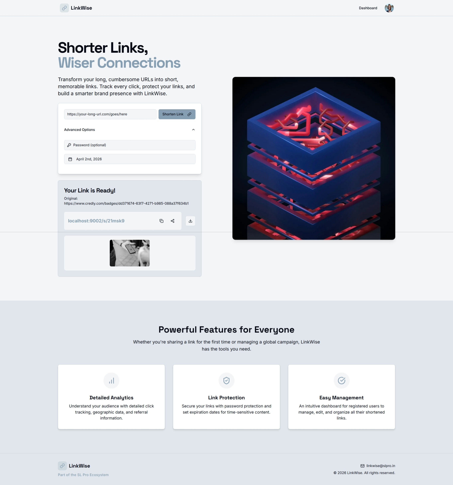
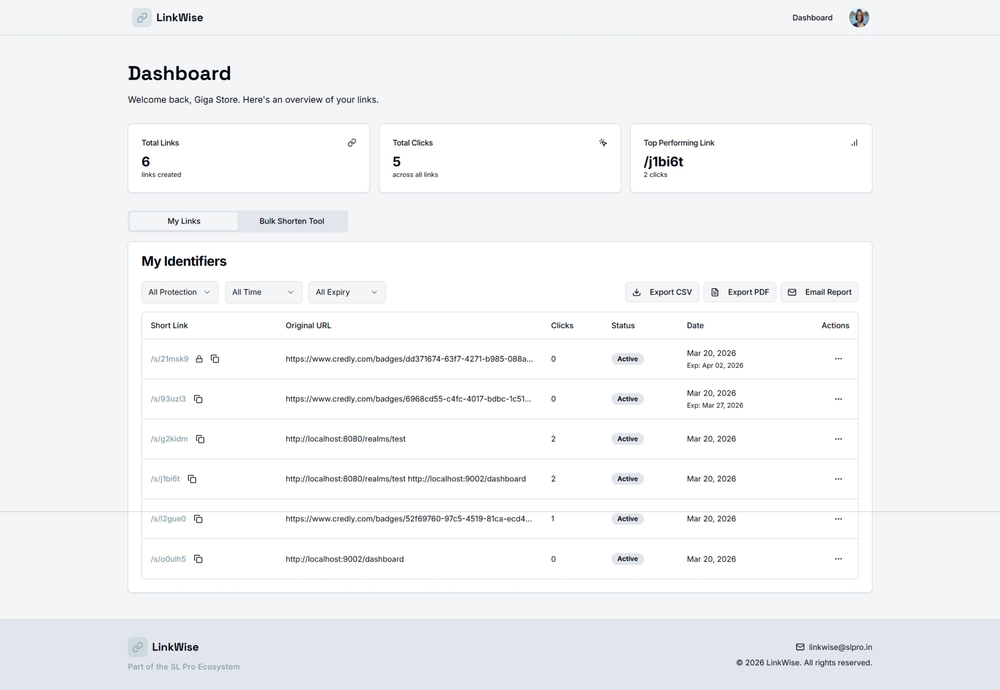
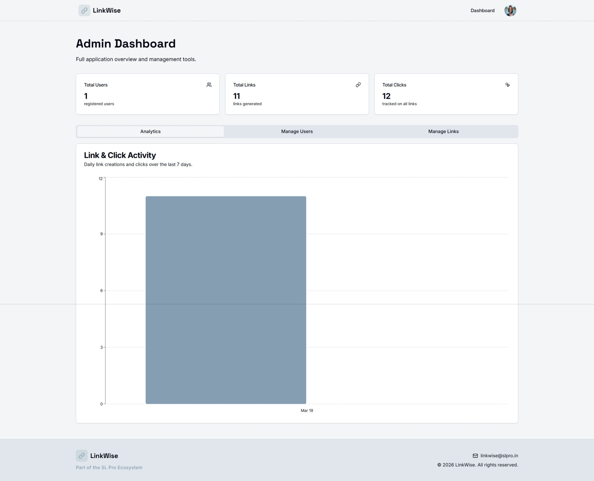

# Link-Wise

**Link-Wise** is a production-ready URL shortener and analytics platform built with **Next.js 15**, **MySQL**, and use **Keycloak based SSO** — part of the **SL Pro Ecosystem**.

---

## Features

- 🔗 **URL Shortening** — Generate short links with custom expiry and password protection
- 📊 **Analytics Dashboard** — Track clicks per link with total click, link & top-link summaries
- 🔐 **Keycloak SSO** — Secure login via OpenID Connect; user roles synced on every login
- 🔒 **Password-Protected Links** — Visitors must enter a password before being redirected
- ⏰ **Expiry Dates** — Links automatically stop working after a configured date
- ✅ **Enable / Disable Links** — Toggle links without deleting them
- 🗑️ **Soft Delete** — Links are soft-deleted to preserve analytics history
- 📋 **Bulk Shortener** — Paste or upload a CSV/TXT file to generate links in bulk
- 🔍 **Dashboard Filters** — Filter your links by protection, created date range, and expiry status
- 📤 **Report Export** — Download filtered links as **CSV** or **PDF** (branded print view)
- 📧 **Email Reports** — Send a branded HTML analytics report via SMTP (or Ethereal for testing)
- 👥 **Admin Panel** — Manage all users and links app-wide

---

## Tech Stack

| Layer        | Technology                         |
|--------------|------------------------------------|
| Framework    | Next.js 15 (App Router, Turbopack) |
| Auth         | NextAuth.js v5 + Keycloak Provider |
| Database     | MySQL 8 via `mysql2`               |
| UI           | Shadcn/UI + Tailwind CSS           |
| Charts       | Recharts                           |
| Email        | Nodemailer (SMTP / Ethereal)       |
| Validation   | Zod                                |
| Containerization | Docker Compose                 |

---

## Getting Started

### Prerequisites

- Node.js 20+
- Docker & Docker Compose (for running MySQL + Keycloak locally)

### 1. Clone & Install

```bash
git clone <repo-url>
cd link-wise
npm install
```

### 2. Configure Environment

Copy and fill in your environment variables:

```bash
cp .env.local.example .env.local
```

| Variable                | Description                                     |
|-------------------------|-------------------------------------------------|
| `DATABASE_URL`          | MySQL connection string                         |
| `AUTH_SECRET`           | Random secret for signing NextAuth tokens       |
| `AUTH_KEYCLOAK_ID`      | Keycloak client ID                              |
| `AUTH_KEYCLOAK_SECRET`  | Keycloak client secret                          |
| `AUTH_KEYCLOAK_ISSUER`  | Keycloak realm issuer URL                       |
| `NEXT_PUBLIC_APP_URL`   | Public base URL of the app                      |
| `SMTP_HOST`             | *(Optional)* SMTP server host for email reports |
| `SMTP_PORT`             | *(Optional)* SMTP port (default: 587)           |
| `SMTP_USER`             | *(Optional)* SMTP login username                |
| `SMTP_PASS`             | *(Optional)* SMTP login password                |

> **Tip:** Leave `SMTP_HOST` empty to use [Ethereal Email](https://ethereal.email) for testing — a preview URL will print to the server console after each send.

### 3. Start Services

```bash
docker-compose up -d    # Starts MySQL + Keycloak
```

### 4. Run the App

```bash
npm run dev
```

The app will be available at **http://localhost:9002**.

---

## Project Structure

```
src/
├── app/
│   ├── dashboard/          # Authenticated user dashboard
│   │   ├── page.tsx        # Server Component: fetches analytics & links
│   │   └── links-table.tsx # Client Component: filtering, export, actions
│   ├── login/              # Login entry point (health-checks Keycloak)
│   └── s/[id]/             # Short link redirect handler
├── components/
│   ├── header.tsx          # Global navigation header
│   ├── footer.tsx          # Global footer
│   ├── link-shortener.tsx  # Link creation form
│   └── bulk-shortener.tsx  # Bulk URL upload/paste form
├── lib/
│   ├── definitions.ts      # TypeScript type definitions
│   ├── db.ts               # MySQL connection pool
│   ├── data.ts             # Server-side data fetchers
│   ├── actions.ts          # Next.js Server Actions
│   ├── auth.ts             # Session + login/logout helpers
│   └── email.ts            # SMTP email utility (Nodemailer)
└── auth.ts                 # NextAuth.js + Keycloak configuration
```

---

## Support

📧 [linkwise@slpro.in](mailto:linkwise@slpro.in)  
© 2025 LinkWise · Part of the SL Pro Ecosystem






       
